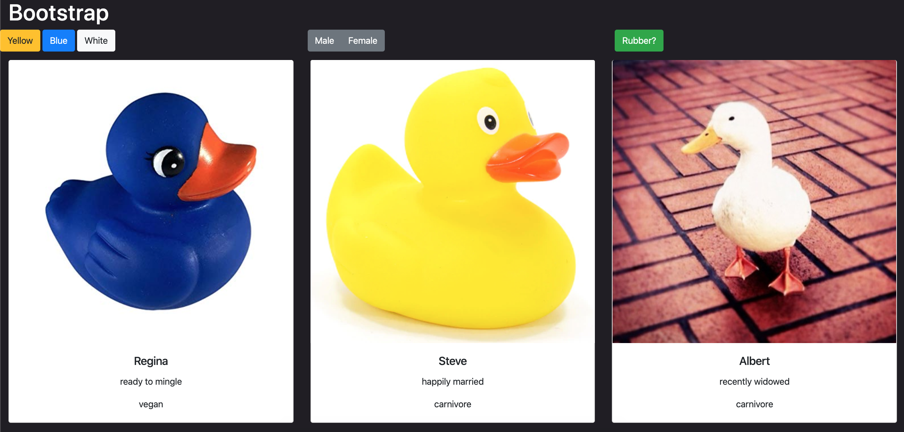

# Bootstrap

## Description
This project was used for an introduction to Bootstrap.

We created an array and looped through that array in main.js to push duck objects to the DOM. The ducks were formatted in Bootstrap card code and organized using Bootstrap grid system. 

We also created Bootstrap buttons and adding eventlisteners to filter the cards displayed on screen.

## Screenshots

## How to run
1. Clone this repo
1. Make sure you have http-server installed via npm. If not get it [here](https://www.npmjs.com/package/http-server)
1. On your command line, run `hs -p 9999`
1. In your browser, go to `http://localhost:9999`
